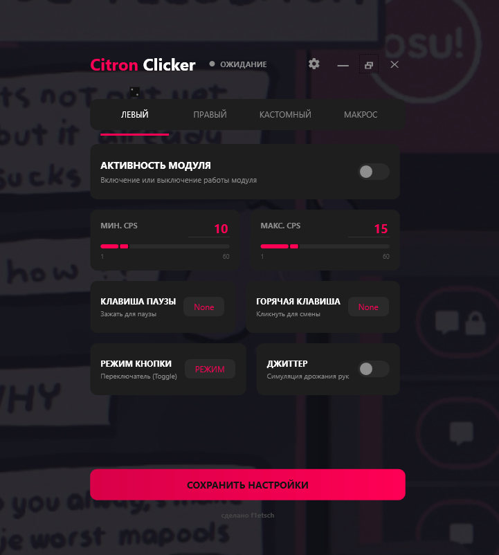
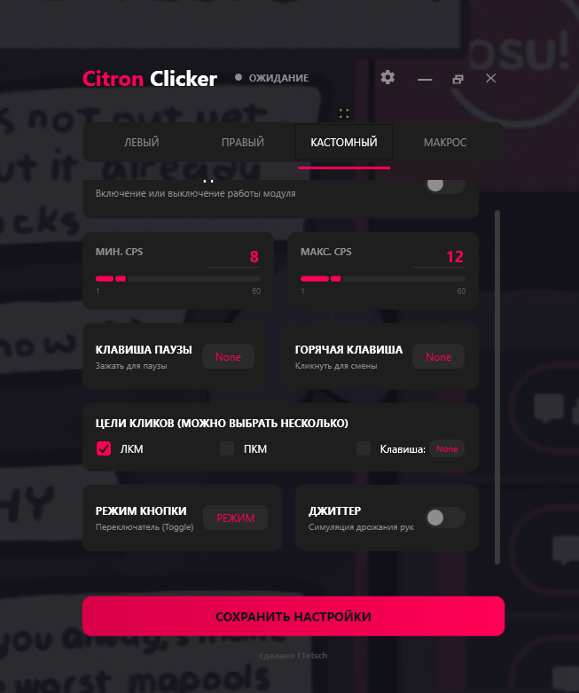
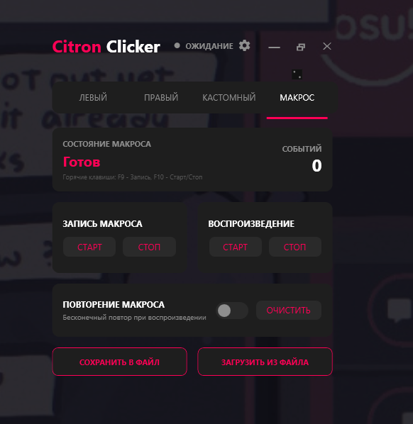
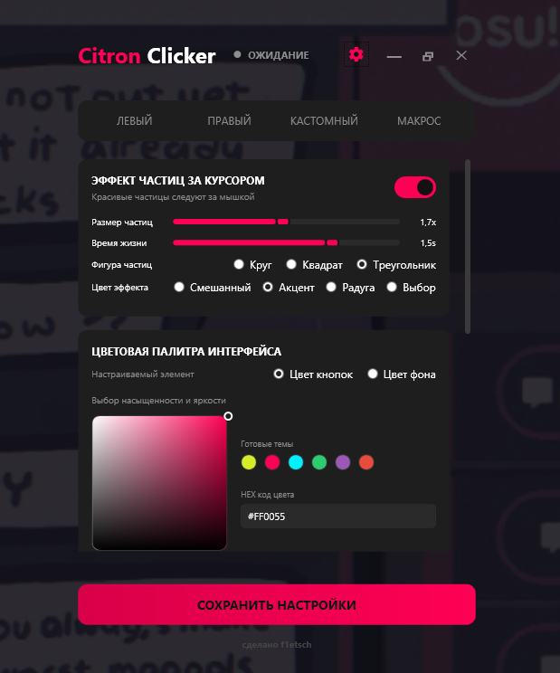
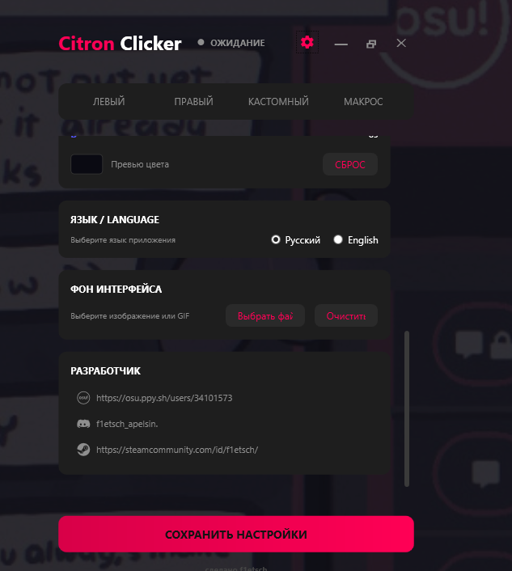

# Citron Clicker 🍋

<p align="center">
  
</p>

<p align="center">
  <strong>A premium, highly customizable auto-clicker and macro recorder built with C# and WPF (.NET 8).</strong>
</p>

<p align="center">
  <a href="#english-english">English</a> • 
  <a href="#русский-russian">Русский</a>
</p>

---

## English (English)

Citron Clicker is a modern utility that combines high-precision mouse/keyboard clicking simulation with an advanced macro recording engine and a beautiful, fully customizable user interface. 

Designed for gamers, power users, and developers, it offers low-level simulation bypasses, customizable cursor visual effects, and a custom UI styling engine (including support for background GIFs).

### 🚀 Key Features

* **3 Independent Clicker Modules**: Left Clicker, Right Clicker, and Custom Clicker running in parallel.
* **Precise CPS Randomization**: Set minimum and maximum Clicks Per Second (1 to 60) to simulate human clicking.
* **Custom Click Targets**: Combine mouse clicks (LMB/RMB) with custom keyboard key inputs (e.g. click Left Mouse and press 'E' simultaneously).
* **Flexible Trigger Modes**: Choose between **Toggle** (press hotkey to start/stop) and **Hold** (runs only while the hotkey is held down).
* **Human-like Jitter**: Simulates micro hand movements (mouse shake) to bypass clicker detection algorithms.
* **Suspend/Pause Key**: Assign a global key that pauses clicking while held.
* **Macro Recorder & Playback**:
  * Records mouse cursor movements (optimized at 100Hz frequency to save file space), mouse clicks, and key presses.
  * Save and load macros to/from `.json` files.
  * Infinite looping playback option.
  * Automated filter to exclude macro trigger hotkeys (F9/F10) from the recording.
* **Cosmetic Particle Trail**: Customizable interactive particle canvas trailing your mouse cursor with options for size, lifetime, shape (Circle, Square, Triangle), and color modes (Mixed, Accent, Rainbow, Selection).
* **UI Theme Customizer**: Real-time theme picker with 6 presets, HEX color code support for backgrounds, and custom background image/GIF support.
* **GitHub Auto-Updates**: Seamless check for updates on startup, downloading new versions directly from GitHub releases.

---

### 📸 Screenshots

#### Left Clicker Settings & Jitter


#### Custom Target Clicker (LMB + Custom Key)


#### Macro Recorder & File Manager


#### Interactive Particle Trail & Color Themes


#### Localization & Custom Backgrounds


---

### 🛠️ Technical Details

* **Language/Framework**: C#, WPF, .NET 8.0-windows
* **System Hooks**: Uses low-level Windows Win32 API hooks (`SetWindowsHookEx` with `WH_KEYBOARD_LL` and `WH_MOUSE_LL`) to capture keys globally even when minimized or out of focus.
* **Timing Precision**: Utilizes native `winmm.dll` via `timeBeginPeriod(1)` to enforce high-resolution 1ms thread sleep timing, ensuring highly stable and accurate CPS execution.
* **Simulation Layer**: Simulates input via native `SendInput` method from `user32.dll` for smooth, low-latency, hardware-like simulation.

---

### 📦 Build Instructions

#### Prerequisites
* [.NET 8.0 SDK](https://dotnet.microsoft.com/download/dotnet/8.0)
* Windows OS (due to Win32/WPF dependencies)

#### Compilation
To compile Citron Clicker into a standalone build, run:
```powershell
dotnet publish -c Release -r win-x64 --self-contained false -p:PublishSingleFile=false -o .\publish
```
Or use the provided PowerShell publish script in the root directory:
```powershell
.\publish.ps1
```

---

## Русский (Russian)

Citron Clicker — это современная утилита, сочетающая в себе высокоточную симуляцию кликов мыши и клавиатуры, мощный инструмент для записи макросов и стильный, гибко настраиваемый пользовательский интерфейс.

### 🚀 Основные возможности

* **3 независимых модуля**: Левый кликер, Правый кликер и Кастомный кликер, работающие параллельно.
* **Точная рандомизация CPS**: Установка минимального и максимального количества кликов в секунду (от 1 до 60) для имитации человеческого нажатия.
* **Кастомные цели клика**: Возможность комбинировать клики мыши (ЛКМ/ПКМ) с нажатием клавиш клавиатуры (например, клик ЛКМ + нажатие клавиши «E»).
* **Гибкие режимы работы**: Переключатель между режимами **Переключатель** (клик по хоткею для старта/стопа) и **Удерживание** (работает только пока зажата горячая клавиша).
* **Симуляция дрожания рук (Джиттер)**: Имитирует микро-движения мыши для обхода систем обнаружения кликеров.
* **Клавиша паузы**: Назначение клавиши временной приостановки кликов при удержании.
* **Запись и воспроизведение макросов**:
  * Запись перемещения курсора (оптимизированная частота 100 Гц для экономии места), нажатий клавиш клавиатуры и кнопок мыши.
  * Сохранение и загрузка макросов в формате `.json`.
  * Режим бесконечного повтора при воспроизведении.
  * Автоматический фильтр управляющих клавиш (F9/F10) из записи.
* **Интерактивные частицы за курсором**: Настройка шлейфа частиц (размер, время жизни, форма: круг/квадрат/треугольник, цвет: радуга/акцент/смешанный).
* **Кастомизация интерфейса**: Встроенный HEX-выбор цвета кнопок и фона, 6 готовых цветовых тем, а также поддержка установки кастомных картинок и анимированных GIF-файлов на фон.
* **Автообновления через GitHub**: Встроенный модуль проверки новых версий напрямую из релизов GitHub при запуске приложения.

---

### 🛠️ Технические детали

* **Язык / Фреймворк**: C#, WPF, .NET 8.0-windows
* **Глобальный перехват ввода**: Использование низкоуровневых системных хуков Windows Win32 API (`SetWindowsHookEx` с `WH_KEYBOARD_LL` и `WH_MOUSE_LL`) для отслеживания клавиш даже в свернутом режиме.
* **Высокая точность таймингов**: Использование библиотеки `winmm.dll` и функции `timeBeginPeriod(1)` для перевода системного таймера планировщика в режим 1 мс, что обеспечивает стабильный и точный CPS без просадок.
* **Имитация ввода**: Отправка нажатий через метод `SendInput` библиотеки `user32.dll` для низкоуровневой и бесперебойной симуляции устройств ввода.

---

### 📦 Инструкция по сборке

#### Требования
* [.NET 8.0 SDK](https://dotnet.microsoft.com/download/dotnet/8.0)
* Операционная система Windows (в связи с использованием Win32 API и WPF)

#### Компиляция
Для сборки исполняемого файла Citron Clicker выполните следующую команду в консоли:
```powershell
dotnet publish -c Release -r win-x64 --self-contained false -p:PublishSingleFile=false -o .\publish
```
Или воспользуйтесь готовым скриптом автоматической публикации:
```powershell
.\publish.ps1
```

---

## Developer / Разработчик
* **osu!**: [f1etsch](https://osu.ppy.sh/users/34101573)
* **Steam**: [f1etsch](https://steamcommunity.com/id/f1etsch/)
* **Discord**: `f1etsch_apelsin`
