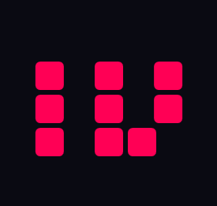
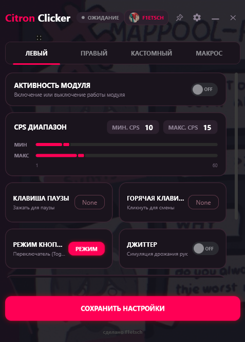
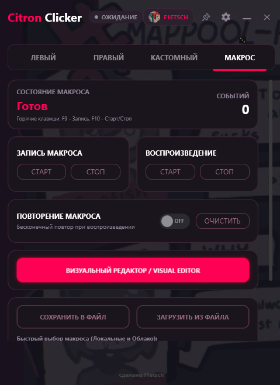
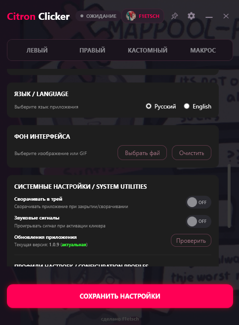
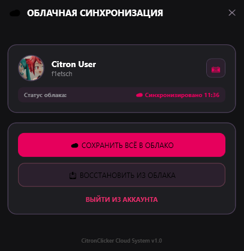

# Citron Clicker 🍋

  

  <strong>A premium, highly customizable auto-clicker, macro recorder, and cloud profile suite built with C# and WPF (.NET 8).</strong>

  
  
  

  <a href="#english-english">English</a> • 
  <a href="#русский-russian">Русский</a>

---

## 📸 Screenshots / Скриншоты

  
  

  
  

---

## English (English)

Citron Clicker is a modern utility that combines high-precision mouse/keyboard clicking simulation with an advanced macro recording engine, active target window binding, cloud synchronization, and a dark cyberpunk WPF user interface.

### 🚀 Key Features

* **☁️ Cloud Sync & Account Storage**: Save and restore all your profiles, hotkeys, themes, particle settings, and macros across devices using Cloud Account Profiles.
* **🎯 Target Window Auto-Binding**: Automatically detects running application/browser windows for targeted clicking and macros.
* **📷 Custom Profile Avatars**: Set custom PNG, JPG, or WebP avatar images rendered in your user profile and top header bar.
* **📜 Macro Quick-Loader & Visual Inspector**: Scan local & cloud macros with 1-click loading and live event monitoring directly inside the floating Mini-HUD.
* **🎨 Dark Cyberpunk Theme & Shader Glow**: Premium dark UI palette (`#121214` background, `#E6005C` primary accent, `#C77DFF` secondary glow) with soft neon drop shadows (`#FF1493`).
* **3 Independent Clicker Modules**: Left Clicker, Right Clicker, and Custom Clicker running in parallel.
* **Precise CPS Randomization**: Set minimum and maximum Clicks Per Second (1 to 60) to simulate natural human clicking.
* **Custom Keyboard & Mouse Targets**: Combine mouse clicks (LMB/RMB) with custom keyboard key inputs (e.g. click Left Mouse and press 'E' simultaneously).
* **Flexible Trigger Modes**: Choose between **Toggle** (press hotkey to start/stop) and **Hold** (runs only while hotkey is held down).
* **Human-like Jitter**: Simulates micro hand movements (mouse shake) to bypass clicker detection algorithms.
* **Cosmetic Particle Trail**: Interactive particle canvas trailing your mouse cursor with customizable size, lifetime, shape, and color modes.
* **Floating Mini-HUD**: Dragable overlay showing live status, CPS, click counters, and macro controls.

---

## Русский (Russian)

Citron Clicker — это современная утилита v2.0.0, сочетающая в себе высокоточную симуляцию кликов мыши и клавиатуры, мощный модуль записи и проигрывания макросов, привязку к активным окнам, облачное хранилище профилей и темный Cyberpunk интерфейс.

### 🚀 Основные возможности

* **☁️ Облачная синхронизация**: Полное сохранение и восстановление всех настроек, горячих клавиш, тем, шлейфа частиц и файлов макросов в облачном аккаунте.
* **🎯 Авто-привязка к окнам приложений**: Выпадающий список активных окон и процессов пользователя для точечного кликинга и макросов.
* **📷 Аватарка профиля**: Установка собственных картинок (PNG, JPG, WebP), отображаемых в профиле и шапке приложения.
* **📜 Выбор и мониторинг макросов**: Быстрый сканер локальных и облачных макросов + вывод статуса макроса прямо в плавающий Mini-HUD.
* **🎨 Неоновый дизайн Cyberpunk**: Стильная тёмная палитра (`#121214` фон, `#E6005C` акцент, `#C77DFF` фиолетовый блеск) с неоновым свечением элементов (`#FF1493`).
* **3 независимых модуля**: Левый кликер, Правый кликер и Кастомный кликер.
* **Точная рандомизация CPS**: Настройка диапазонов кликов в секунду (от 1 до 60).
* **Кастомная привязка клавиш**: Комбинации кнопок мыши и любых клавиш клавиатуры.
* **Джиттер (дрожание рук)**: Имитация микро-смещений курсора для обхода систем защиты.
* **Плавающий Mini-HUD**: Виджет поверху всех окон с отображением CPS, кликов и кнопками макросов.

---

### 🛠️ Технические детали

* **Язык / Фреймворк**: C#, WPF, .NET 8.0-windows
* **Глобальный перехват ввода**: Низкоуровневые системные хуки Windows Win32 API (`SetWindowsHookEx` с `WH_KEYBOARD_LL` и `WH_MOUSE_LL`).
* **Высокая точность таймингов**: Перевод системного таймера `winmm.dll` (`timeBeginPeriod(1)`) в режим 1 мс.
* **Имитация ввода**: Отправка нажатий через метод `SendInput` библиотеки `user32.dll`.

---

## Developer / Разработчик
* **osu!**: [f1etsch](https://osu.ppy.sh/users/34101573)
* **Steam**: [f1etsch](https://steamcommunity.com/id/f1etsch/)
* **Discord**: `f1etsch_apelsin`
